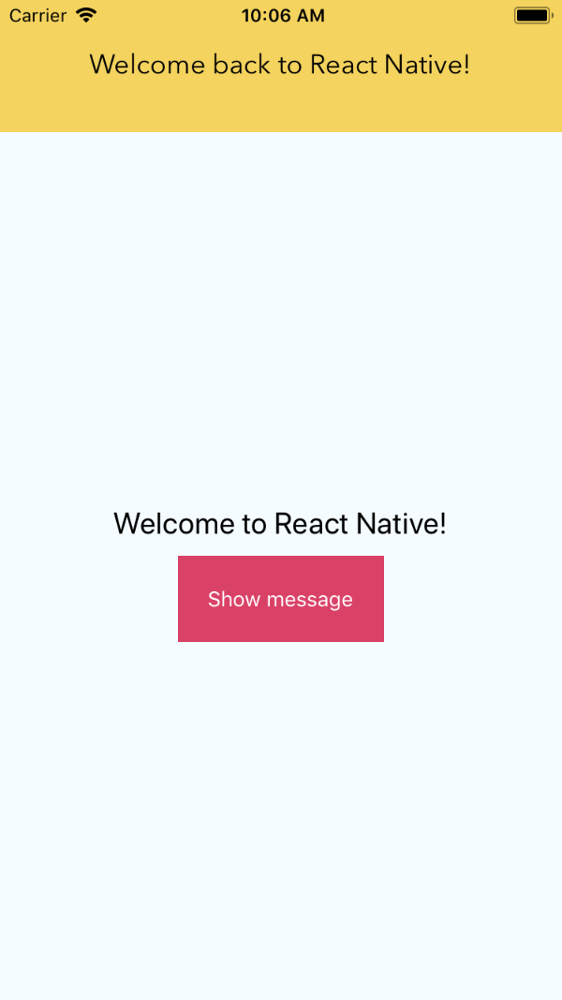

# react-native-slider-alert

<p>


</p>

A React Native component to show a top message, useful for ScrollView or View.

<p align="center">

</p>

## Getting started

```sh
$ yarn add react-native-slider-alert
```

## Usage

To show the message and the slider alert, you should place the `SliderAlert` element at the top of the `render` method and jsx.
Then, call `showAlert` function to display it, as the example below. This function accepts a required message (`string` type) and a optional function that will be executed when animation ends.

```js
/* @flow */

import React from 'react';
import { TouchableOpacity, StyleSheet, Text, View, Image } from 'react-native';
import SliderAlert from './lib/SliderAlert';

type Props = {};

export default class App extends React.PureComponent<Props> {
  _alert: SliderAlert;

  onPressButton = () => {
    this._alert.showAlert('Welcome back to React Native!', () =>
      console.log('onAnimationEnd');
    );
  };

  render() {
    return (
      <View style={styles.top}>
        <SliderAlert
          ref={(ref: any) => {
            this._alert = ref;
          }}
          startValue={70}
          value={0}
          containerStyle={{
            backgroundColor: '#F4D35E'
          }}
          titleStyle={{
            fontSize: 18,
            fontFamily: 'Avenir Next'
          }}
        />
        <View style={styles.container}>
          <Text style={styles.welcome}>Welcome to React Native!</Text>
          <TouchableOpacity style={styles.button} onPress={this.onPressButton}>
            <Text style={styles.title}>Show message</Text>
          </TouchableOpacity>
        </View>
      </View>
    );
  }
}

const styles = StyleSheet.create({
  top: {
    flex: 1
  },
  container: {
    flex: 1,
    justifyContent: 'center',
    alignItems: 'center',
    backgroundColor: '#F5FCFF'
  },
  welcome: {
    fontSize: 20,
    textAlign: 'center',
    margin: 10
  },
  button: {
    backgroundColor: '#DA4167'
  },
  title: {
    margin: 20,
    color: '#FFFFFF'
  }
});
```

## API

|   Props    |        Type        |                     Description                      | Required |
| :--------: | :----------------: | :--------------------------------------------------: | :------: |
| startValue |       number       | The initial value at which the animation will expand |    ✓     |
|   value    |       number       |     The final value which will end the animation     |    ✓     |
| titleStyle |       Object       |                 Styles of the title                  |    ✗     |
|   delay    |       number       |       Delay value of the predefined animation        |    ✗     |
|  duration  |       number       |      Duration value of the predefined animation      |    ✗     |
|  children  | React.ReactElement |   Custom children prop. Accepts any React element    |    ✗     |

## License

MIT License

Copyright (c) 2018 [InterfaceKit](https://github.com/InterfaceKit)

## Author

Antonio Moreno Valls `<amoreno at apsl.net>`

Built with 💛 by [APSL](https://github.com/apsl).
